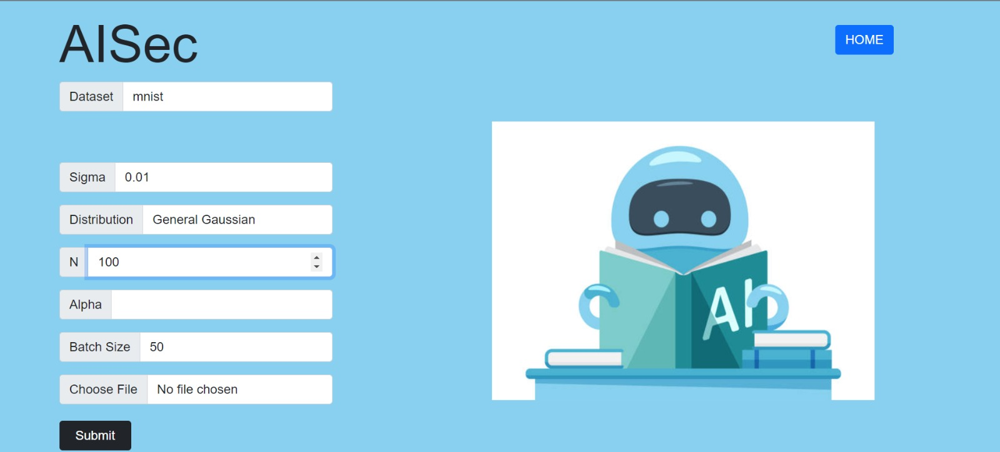
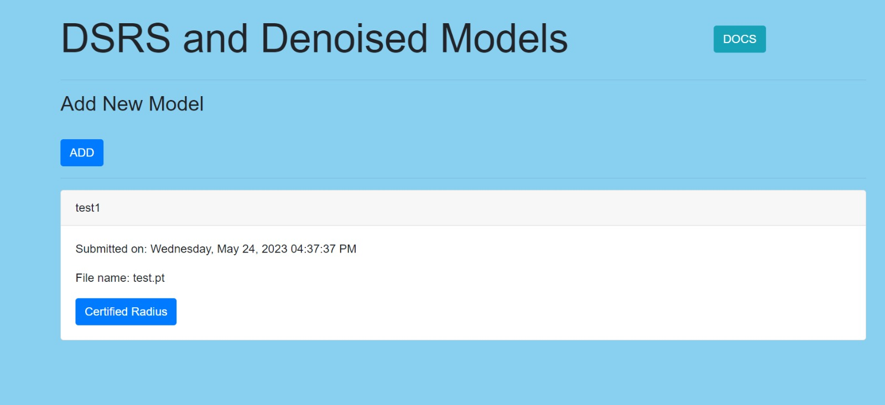

# AIKavach

Using Randomized Smoothing to get robust models, certifiably!

## Table of Contents

- [Introduction](#introduction)
- [Motivation](#motivation)
 - [File Structure](#file-structure)
- [File Description](#file-description)
- [Installation](#installation)
- [How to navigate the website](#how-to-navigate-the-website)
- [Usage](#usage)
- [Contributing](#contributing)
- [License](#license)

## Introduction

Neural networks (NNs) have achieved great advances in a wide range of classification tasks. However, it is widely acknowledged that even subtle modifications to the inputs of image classification systems can lead to incorrect predictions. Take, for example, a model trained to classify images of a deer. The model easily classifies an image of the animal grazing in a grassy field. Now, if just a few pixels in that image are maliciously altered, you can get a very different and wrong prediction despite the image appearing unchanged to the human eye. Sensitivity to such input perturbations, which are known as adversarial examples, raises security and reliability issues for the vision-based systems that we deploy in the real world. To tackle this challenge, our project aims to provide certified robustness for large-scale datasets against adversarial perturbations using various defenses proposed to robustify deep learning models, particularly randomized smoothing.


 ## Motivation


This project incorporates techniques such as DSRS (Double Sampling Randomized Smoothing), ISS (Input-Specific Sampling), and Denoised Smoothing to establish robust models and certified radii.

Robustness certification aims to determine a robust radius for a given input instance and model, representing the maximum allowable perturbation without affecting the final prediction. Certification approaches tend to be conservative, offering a lower bound on the robust radius, while the actual maximum robust radius for a specific input instance may surpass the certified value.

Randomized smoothing has gained popularity as a technique for providing certified robustness in large-scale datasets. Essentially, randomized smoothing smooths out a classifier: it takes a “brittle” or “jittery” function and makes it more stable, helping to ensure predictions for inputs in the neighborhood of a specific data point are constant. It involves sampling noise from a smoothing distribution to construct a smoothed classifier, thereby certifying the robust radius for the smoothed classifier. Compared to other techniques, randomized smoothing is efficient, model-agnostic, and applicable to a wide range of machine-learning models.

In the case of randomized smoothing (RS), the most widely used certification approach is known as Neyman-Pearson-based certification. It relies on the probability of the base model predicting each class under the input noise to compute the certification. However, this approach encounters difficulties scaling to large datasets due to the "Curse of Dimensionality."

To overcome the limitations of Neyman-Pearson-based certification, we have employed DSRS, which samples the prediction statistics of the base model under two different distributions and utilizes the joint information for certification computation. By incorporating more information, this certification approach surpasses the barrier posed by Neyman-Pearson-based certification and provides a tighter (if not equal) certification than the widely used approach.


Image demonstrating differences between N-P and DSRS approach taken from [this](https://arxiv.org/abs/2206.07912) paper.


Here,

```math
\begin{align}
P_A &= f^P(x_0)_{y_0} = Pr_{\epsilon \sim P}[F(x_0+\epsilon) = y_0] \\
Q_A &= f^Q(x_0)_{y_0} = Pr_{\epsilon \sim P}[F(x_0+\epsilon) = y_0] 
\end{align}
```


 More details can be found in [this](https://arxiv.org/abs/2206.07912) paper.

In practice, it is hard to calculate P<sub>A</sub> and Q<sub>A</sub>, so it’s estimated using Monte-Carlo sampling, which gives a confidence interval of P<sub>A</sub> and Q<sub>A</sub>.For a base classifier ___F___
, one can apply the above procedure to get a prediction of any data point along with a robustness guarantee in the form of a certified radius, the radius around a given input for which the prediction is guaranteed to be fixed. But the above procedure assumes that the base classifier  ___F___ classifies well under Gaussian perturbations of its inputs. Now what if the base classifier  ___F___ is some off-the-shelf classifier that wasn’t trained specifically for randomized smoothing—that is, it doesn’t classify well under noisy perturbations of its inputs. With denoised smoothing, we make randomized smoothing effective for classifiers that aren’t trained specifically for randomized smoothing. The method is straightforward; as mentioned above, instead of applying randomized smoothing to these classifiers, we prepend a custom-trained denoiser in front of these classifiers and then apply randomized smoothing. The denoiser helps by removing noise from the noisy synthetic copies of the input, which allows the pre-trained classifiers to give better predictions. In this project, we used **DRUNET** as a denoiser for denoised smoothing.


Image showing architecture of **DRUNET** taken from  [paper](https://arxiv.org/pdf/2008.13751.pdf).

DruNet Architecture [paper](https://arxiv.org/pdf/2008.13751.pdf)

 Now the focus is on improving the computational efficiency of certified robustness in randomized smoothing. While randomized smoothing has shown promising results in terms of robustness, the certification process can be computationally demanding, making it less practical for real-world applications.

 One of the main challenges lies in the estimation of confidence intervals, which heavily relies on large sample approximations. Existing methods typically use an input-agnostic sampling (IAS) scheme, where the sample size for the confidence interval is fixed regardless of the input. However, this approach may result in a suboptimal trade-off between the average certified radius (ACR) and runtime.

 To address this issue, we used an approach called Input-Specific Sampling (ISS) acceleration, which aims to achieve cost-effective robustness certification by adaptively reducing the sampling size based on the input characteristics. By doing so, the proposed method improves the efficiency of the certification process while still maintaining control over the decline in the certified radius resulting from the reduced sample size.

 The experiments from [this](https://arxiv.org/abs/2112.12084) paper demonstrate that ISS can speed up the certification process by more than three times with a limited cost of reducing the certified radius by 0.05. Additionally, ISS outperforms the input-agnostic sampling (IAS) scheme in terms of the average certified radius across various hyperparameter settings.


 ## File Structure


 ### A typical top-level directory layout

```
.
├── LICENSE
├── README.md                    <- The top-level README for developers using this project
├── readme_images                <- Directory for readme-related images
├── docs                         <- A default Sphinx project; see sphinx-doc.org for details
│
├── denoiser
│   ├── data                     <- Intermediate data that has been transformed
│   ├── train_denoiser.py        <- Python script for training the denoiser
│   ├── denoising
│   │   └── drunet               <- The final, canonical data sets for modeling
│   ├── utilities                <- Utility scripts for the denoiser
│   │   ├── extra                <- Extra utilities
│   │   └── utils_image.py       <- Utility functions for image processing
│   ├── models                   <- Contains models of the denoiser
│   │   ├── model_base.py        <- Base model class
│   │   ├── model_plain.py       <- Plain model class
│   │   ├── network_unet.py      <- U-Net network architecture
│   │   └── select_network.py    <- Script for selecting the network
│   └── options                  <- Default JSON file for training
│
├── references                   <- Data dictionaries, manuals, and all other explanatory materials
│
├── web                          <- Generated analysis as HTML, PDF, LaTeX, etc.
│   ├── app.py                   <- Python script for the web application
│   └── flask_try.py             <- Generated graphics and figures to be used in reporting
│
├── requirements.txt             <- The requirements file for reproducing the analysis environment
│
├── setup.py                     <- Make this project pip installable with `pip install -e`
│
├── src                          <- Source code for use in this project
│   ├── main.py                  <- Python module
│   ├── main.sh                  <- Shell script
│   ├── data                     <- Scripts to download or generate data
│   │   └── make_dataset.py      <- Script to make dataset
│   ├── features                 <- Scripts to turn raw data into features for modeling
│   │   ├── algo.py              <- Intermediate data that has been transformed
│   │   ├── distribution.py      <- Intermediate data that has been transformed
│   │   └── smooth.py            <- Script for smoothing data
│   ├── models                   <- Scripts to train models and make predictions
│   │   ├── train.py             <- Script for model training
│   │   └── sample.py            <- Script for model prediction sampling
│   └── utilities                <- Scripts for exploratory and results-oriented visualizations
│       └── utils.py             <- Utility functions
│
└── test                         <- python test files

```                 


## File Description


## Installation

To use this Project, follow these steps:

1. Clone the repository: `https://github.com/dsgiitr/aisec.git`
2. Install dependencies: `npm install`
3. Configure the application by updating the `config.js` file with your settings.
4. Launch the application: `npm start`
5. Open your web browser and visit `http://localhost:3000`.

## How to navigate the website

On setting up the website locally, you can access its features by following these steps:

1. Begin by visiting the landing page and locate the "Add" button. By clicking on this button, you will be directed to a form.



2. In the form, you will need to provide various inputs, including your model file, distribution, dataset type, and fix the values of sigma, alpha, and batch size.



3. After filling in the necessary information, submit the form. You will then be redirected back to the landing page, where you will notice an additional row under the "Add new model" section. This row represents your model. From here, you can calculate the certified radius by clicking on the "Certified Radius" button associated with your model.

4. In addition, you will find a "Docs" button on the navigation bar. Clicking on this button will take you to the comprehensive documentation of the website, providing detailed information and instructions.


## Usage


##### Preparation


1. **Sampling & get the probability (P_A and Q_A) under two distributions**

    

2. **Compute the Neyman-Pearson-based certification**


3. **Compute the DSRS certification**


##### Appendix: Training Scripts

The repo also contains code that trains the model suitable for DSRS certification (as discussed in Appendix I).

`train.py` code is adapted from Consistency training code in https://github.com/jh-jeong/smoothing-consistency.

`train_smoothmix.py` code is adapted from SmoothMix training code in https://github.com/jh-jeong/smoothmix.

For MNIST and CIFAR-10, we train from scratch. For ImageNet, we finetune from pretrained ImageNet models for a few epochs.
Whent the training is finished, we need to copy the `*.pth.tar` model to `models/` folder.

- Gaussian augmentation training:
  - MNIST: `python train.py mnist mnist_43 --lr 0.01 --lr_step_size 50 --epochs 150  --noise 0.25/0.50/1.00/... --num-noise-vec 1 --lbd 0 --k 380 --k-warmup 100`
  - CIFAR-10: `python train.py cifar10 cifar_resnet110 --lr 0.01 --lr_step_size 50 --epochs 150  --noise 0.25/0.50/1.00/... --num-noise-vec 1 --lbd 0 --k 1530 --k-warmup 100`
  - ImageNet: `python train.py imagenet resnet50 --lr 0.001 --lr_step_size 1 --epochs 6  --noise 0.25/0.50/1.00 --num-noise-vec 1 --lbd 0 --k 75260 --k-warmup 60000 --batch 96 --pretrained-model ../../pretrain_models/cohen_models/models/imagenet/resnet50/noise_[0.25/0.50/1.00]/checkpoint.pth.tar`
    
    Note: the pretrained models are from Cohen et al's randomized smoothing [repo](https://github.com/locuslab/smoothing), and the direct link is here: https://drive.google.com/file/d/1h_TpbXm5haY5f-l4--IKylmdz6tvPoR4/view.

- Consistency training:
  - MNIST: `python train.py mnist mnist_43 --lr 0.01 --lr_step_size 50 --epochs 150  --noise 0.25/0.50/1.00 --num-noise-vec 2 --lbd 5 --k 380 --k-warmup 100`
  - CIFAR-10: `python train.py cifar10 cifar_resnet110 --lr 0.01 --lr_step_size 50 --epochs 150  --noise 0.25/0.50/1.00 --num-noise-vec 2 --lbd 20 --k 1530 --k-warmup 100`
  - ImageNet: `python train.py imagenet resnet50 --lr 0.001 --lr_step_size 1 --epochs 6  --noise 0.25/0.50/1.00 --num-noise-vec 2 --lbd 5 --k 75260 --k-warmup 60000 --batch 96 --pretrained-model ../../pretrain_models/cohen_models/models/imagenet/resnet50/noise_[0.25/0.50/1.00]/checkpoint.pth.tar`
  
- SmoothMix training:
  - MNIST: `python train_smoothmix.py mnist mnist_43 --lr 0.01 --lr_step_size 30 --epochs 90  --noise_sd 0.25/0.50/1.00 --eta 5.00 --num-noise-vec 4 --num-steps 8 --mix_step 1 --k 380 --k-warmup 70`
  - CIFAR-10: `python train_smoothmix.py cifar10 cifar_resnet110 --lr 0.1 --lr_step_size 50 --epochs 150  --noise_sd 0.5 --eta 5.00 --num-noise-vec 2 --num-steps 4 --alpha 1.0 --mix_step 1 --k 1530 --k-warmup 110`
  - ImageNet: `python train_smoothmix.py imagenet resnet50 --lr 0.01 --lr_step_size 30 --epochs 10  --noise_sd 0.5 --eta 1.00 --num-noise-vec 1 --num-steps 1 --alpha 8.0 --mix_step 0 --k 75260 --k-warmup 200000 --batch 48 --pretrained-model ../../pretrain_models/cohen_models/models/imagenet/resnet50/noise_0.50/checkpoint.pth.tar`


## Contributing

Contributions are welcome! If you want to contribute to this Project, please follow these guidelines:

1. Fork the repository and create your branch: `git checkout -b feature/my-new-feature`
2. Commit your changes: `git commit -am 'Add some feature'`
3. Push to the branch: `git push origin feature/my-new-feature`
4. Submit a pull request detailing your changes.

Please ensure your code follows the established coding conventions and includes appropriate tests.

## License

This project is licensed under the MIT License.

## Additional Sections

- **Deployment**: Visit our deployment guide for instructions on how to deploy the application to various platforms.

 - **FAQ**: Check out our FAQ section for answers to common questions.
